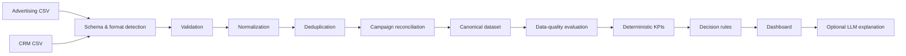

# Pipeline Pulse

**Marketing & CRM data reconciliation for reliable performance decisions.**

Pipeline Pulse is a portfolio prototype for a common Marketing Operations problem: advertising spend and CRM outcomes often live in separate exports, with inconsistent names, duplicated rows, missing identifiers, mixed formats, and data-quality issues that make downstream KPIs unreliable.

The application takes an advertising CSV and a CRM CSV, validates and reconciles them, exposes data-quality problems, and produces deterministic metrics and decision signals.

**Live demo:** https://tiagomf.com/pipeline  
**Case study:** https://tiagomf.com/pipeline-pulse

> **The system calculates. AI explains.**

---

## Why I built it

A dashboard is only as trustworthy as the data feeding it.

Pipeline Pulse focuses on the operational layer before reporting:

- detect and validate incoming CSV structures;
- normalize inconsistent values and formats;
- remove replayed duplicates without collapsing legitimate dimensions;
- reconcile CRM records to advertising campaigns;
- quarantine malformed or ambiguous data instead of guessing;
- calculate KPIs from the accepted canonical dataset;
- apply explicit decision rules;
- optionally generate an executive explanation from already-computed results.

The goal is not to simulate a full attribution platform. It is to show how a small internal tool can turn fragmented exports into a traceable, reviewable decision workflow.

---

## Try it without your own files

The public demo includes **synthetic sample data** so the full workflow can be evaluated without uploading real business data.

Use **Try sample data / Carregar dados de exemplo** in the application.

The current fixture contains six campaigns and deliberately includes duplicate rows so the same validation, deduplication, reconciliation, KPI, and decision pipeline is exercised.

Expected aggregate results from the synthetic fixture:

| Metric | Expected result |
| --- | ---: |
| Ad spend | $46,800 |
| Closed-won revenue | $149,400 |
| Open pipeline | $232,000 |
| ROAS | 3.19× |
| Closed-won records | 67 |
| Duplicates removed | 14 |

The fixture is processed by the real analysis path; the dashboard values are not hard-coded.

---

## Processing pipeline



The deterministic pipeline lives primarily in:

- `lib/import-format.js` — delimiter, encoding, field, date, currency, and format inference;
- `lib/pipeline.js` — validation, normalization, deduplication, reconciliation, KPIs, quality checks, and decision rules;
- `lib/demo.js` — reproducible synthetic sample data;
- `lib/explanation.js` — optional server-side explanation boundary.

No LLM participates in validation, reconciliation, KPI calculation, or decision classification.

---

## Reconciliation rules

Pipeline Pulse is intentionally conservative.

1. **Exact campaign IDs are preferred.**
2. A CRM record with no campaign ID may fall back to a **unique normalized campaign name**.
3. Name normalization handles case, punctuation, Unicode differences, word ordering, camel case, percent notation, and a limited set of equivalent tokens.
4. If a normalized name maps to multiple campaigns, the record remains **ambiguous**.
5. If an explicit CRM campaign ID conflicts with the advertising ID, the system **does not fall back to the name**.
6. Unmatched and quarantined records remain visible in Data Quality and are excluded from attributed metrics.

The application favors a visible unresolved record over a confident-looking but unsupported match.

---

## Deterministic metrics

The dashboard calculates:

- **Total ad spend** — accepted advertising rows;
- **CAC** — accepted ad spend / matched closed-won CRM records;
- **ROAS** — matched closed-won revenue / accepted ad spend;
- **Open pipeline** — matched open-opportunity amounts;
- **Match rate** — matched CRM records / accepted unique CRM records.

Amounts are handled with bounded precision, invalid values are rejected, and zero denominators return unavailable metrics rather than `Infinity` or fabricated zeros.

---

## Decision rules

Recommendations are fixed business rules, not model predictions.

| Decision | Rule |
| --- | --- |
| **Scale** | ≥ 3 closed-won records, positive spend, ROAS ≥ 3 |
| **Maintain** | Same evidence floor, ROAS ≥ 1 and < 3 |
| **Optimize** | Same evidence floor, ROAS < 1 |
| **Gather data** | Minimum evidence not met |
| **Review data** | Any unmatched or quarantined record pauses recommendations |

Because the thresholds are explicit, the same accepted dataset always produces the same result.

---

## Data-quality behavior

Examples of conditions that are surfaced rather than silently repaired include:

- duplicate and conflicting CRM IDs;
- ambiguous campaign names;
- explicit mismatched campaign IDs;
- malformed or impossible dates;
- unknown stages;
- negative or malformed monetary values;
- mixed currencies without a selected reporting currency;
- repeated headers and ragged rows;
- executable spreadsheet cells;
- resource-limit violations.

The quality report keeps these issues inspectable and separates them from accepted records.

---

## Optional AI explanation

Pipeline Pulse uses a strict boundary between calculation and explanation.

The public analysis workflow is deterministic. An optional private/server-side LLM adapter can receive **recomputed aggregate facts and fixed decision labels** to produce an executive explanation.

It cannot:

- calculate or replace KPIs;
- change campaign matches;
- change decision rules;
- overwrite deterministic results.

Raw campaign names, IDs, emails, and source CSV cells are not forwarded to the external explanation adapter.

If no explanation service is configured, the application remains fully usable and shows a rule-based preview.

---

## Supported imports

The import layer handles, among other cases:

- comma, semicolon, tab, and pipe delimiters;
- quoted and multiline fields;
- common export preambles;
- UTF-8, UTF-16 LE/BE, and Windows-1252;
- decimal comma or decimal point;
- currency prefixes and suffixes;
- ISO, year-first, day-first/month-first, named-month, and Excel serial dates;
- optional CRM record IDs;
- nonstandard field names through detection or manual mapping.

Current file limits are 5 MB, 25,000 rows, 100 columns, and 2,000 characters per cell.

---

## Tech stack

- **Next.js 16**
- **React 19**
- **JavaScript / Node.js**
- **Tailwind CSS 4**
- **Papa Parse**
- **Node test runner**
- **Playwright**
- **Vite / vinext**
- **Cloudflare Workers**

CSV processing is browser-local. The optional explanation route is server-side.

---

## Run locally

Requires **Node.js 22.12+**.

```bash
npm install
npm run dev
```

Open:

```text
http://127.0.0.1:3000
```

Production build:

```bash
npm run build
npm start
```

Run the Node test suite:

```bash
npm test
```

Run browser tests:

```bash
npx playwright test
```

Cloudflare build:

```bash
npm run build:cloudflare
```

---

## Testing

The repository includes deterministic tests for cases such as:

- duplicate replay;
- conflicting CRM versions;
- order invariance;
- unmatched and mismatched IDs;
- normalized and ambiguous names;
- zero denominators;
- mixed currencies;
- malformed CSV;
- custom mappings;
- row and cell limits;
- formula/prototype/XSS-style inputs;
- fixed decision thresholds;
- safe CSV export;
- optional LLM boundary and failure behavior;
- reproducible sample-data totals.

Browser tests cover the import workflow, navigation, language switching, fallback behavior, and responsive UI behavior.

---

## Current scope and limitations

Pipeline Pulse is a **portfolio prototype**, not a production attribution platform.

It currently does not provide:

- a persistent database;
- live CRM or advertising-platform connectors;
- multi-touch attribution;
- automatic FX conversion;
- inferred timezone alignment;
- inferred sales-cycle lag;
- durable user accounts or saved analyses.

Uploaded data and results are cleared on reload.

The prototype assumes that the advertising and CRM exports represent a compatible business period and attribution model.

---

## Project approach

I built Pipeline Pulse as a practical Marketing Operations case study.

My focus was defining the operational problem, data contracts, reconciliation behavior, business rules, acceptance criteria, test scenarios, and release decisions. Implementation was AI-assisted, with deterministic tests and manual validation used to verify the resulting behavior.

The project is meant to demonstrate a broader working pattern:

**find an operational bottleneck → understand the data → define explicit rules → build a reliable internal tool → make the result inspectable.**

---

## Related links

- **Live application:** https://tiagomf.com/pipeline
- **Case study:** https://tiagomf.com/pipeline-pulse
- **Portfolio:** https://tiagomf.com
