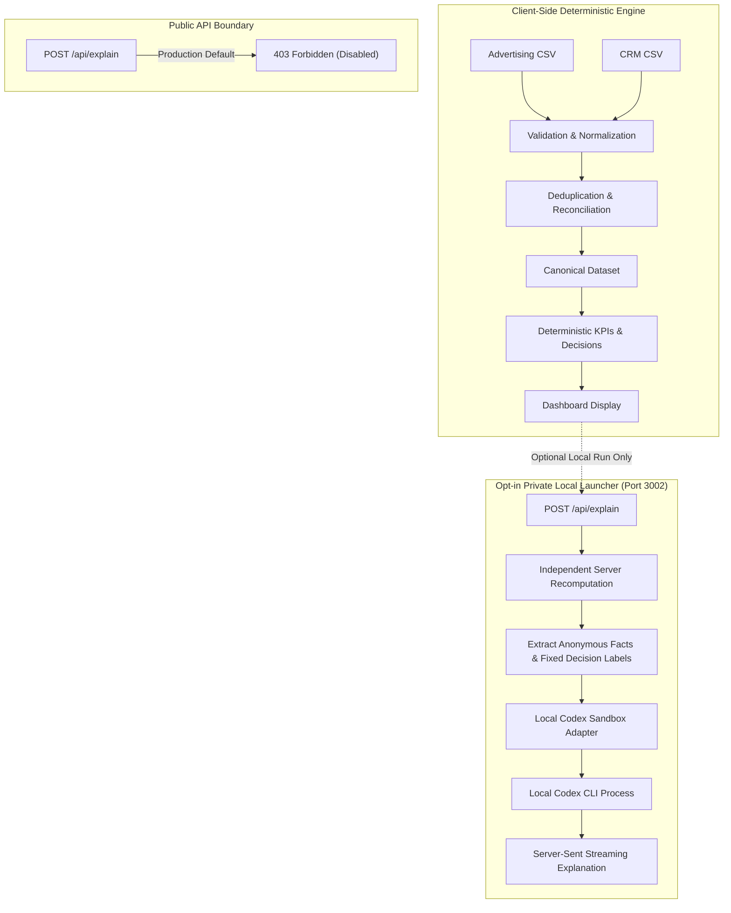

# AI Explanation Architecture & Local Setup

Pipeline Pulse enforces a strict separation of concerns between deterministic calculation and generative natural language explanation:

> **The system calculates. AI explains.**

This document explains the architectural boundary between public execution and the optional local AI explanation adapter, as well as instructions for connecting a local LLM via the official OpenAI Codex CLI.

---

## 1. Architectural Boundary



### Core Invariants

1. **Public Execution is 100% Deterministic:**
   The public application deployed to Cloudflare Workers never makes outbound requests to any LLM service. The `/api/explain` route returns HTTP 403 Forbidden unconditionally. No API keys, credentials, or prompts are shipped with public application bundles.
2. **Independent Recomputation:**
   When the local explanation launcher is invoked, raw files are sent to the local server, which independently parses and recomputes all metrics from scratch. Calculations from the browser are never trusted blindly.
3. **No PII or Raw Rows Forwarded:**
   The payload delivered to the LLM contains only anonymous, aggregate numerical facts and fixed decision labels (e.g. `ROAS: 3.19`, `Status: Scale`). Customer emails, account names, deal IDs, and advertising row data are strictly excluded.
4. **Read-Only / One-Way:**
   Generated text is displayed as plain informational prose. An explanation response cannot alter KPIs, adjust match rates, or reclassify campaign decisions.

---

## 2. Local Opt-In Launcher Implementation

For local development or private evaluation, an opt-in launcher runs a dedicated loopback server:

- **Command:** `npm run dev:chatgpt`
- **Port:** `http://127.0.0.1:3002`
- **Adapter Source:** [`scripts/local-chatgpt.mjs`](../scripts/local-chatgpt.mjs), [`scripts/local-chatgpt-adapter.mjs`](../scripts/local-chatgpt-adapter.mjs)

### Security & Sandbox Hardening

The local launcher is engineered with explicit guardrails:

- **Loopback Only:** Binds strictly to `127.0.0.1`. Requests with mismatched `Origin` or `Host` headers are rejected with HTTP 403.
- **Process Concurrency:** Permits only one explanation generation process at a time.
- **Execution Sandbox:**
  - Invokes Codex with an isolated, empty temporary working directory (`os.tmpdir()`).
  - Enforces read-only sandbox mode (`--sandbox read-only`).
  - Creates ephemeral sessions (`--ephemeral`) without persistent history.
  - Explicitly disables shell execution, web browsing, custom tools, and user configuration overrides (`--disable-shell --disable-browser --disable-tools`).
- **Strict Timeout:** Applies a hard 20-second execution timeout.
- **Tunnel Warning:** Never expose the local launcher port through public tunneling services (e.g., ngrok, Cloudflare Tunnel).

---

## 3. Local Setup with Official Codex CLI

### Prerequisites

1. Install the official OpenAI Codex CLI.
2. Authenticate using your existing subscription:
   ```bash
   codex login
   ```
3. (Optional) If the CLI executable is not on your global system `PATH`, configure its path via environment variable:
   ```powershell
   $env:PIPELINE_CODEX_BIN = 'C:\Path\To\codex.exe'
   ```

### Starting the Launcher

From the project root:

```powershell
npm run dev:chatgpt
```

Open `http://127.0.0.1:3002` in your browser. The "Generate AI summary" button will now utilize your authenticated local Codex subscription to produce executive summaries of the calculated results.

---

## 4. References

- [OpenAI Codex Non-Interactive Mode](https://learn.chatgpt.com/docs/non-interactive-mode)
- [OpenAI Codex Authentication Documentation](https://learn.chatgpt.com/docs/auth)
- [Pipeline Pulse Architecture Guide](ARCHITECTURE.md)
